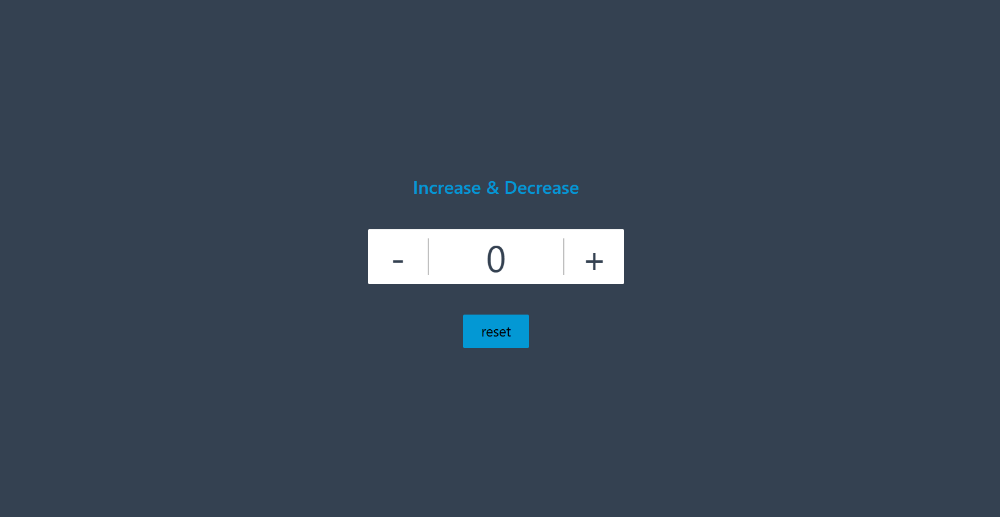

# Counter App

A simple React application that allows users to increment, decrement, and reset a counter value.



## ✨ Features

- Increment the counter
- Decrement the counter
- Reset to zero
- Clean, responsive UI

## 🛠️ Built With

- React (Hooks)
- HTML & CSS (inline or external styles)
- JavaScript

## 🚀 Getting Started

### Prerequisites

Make sure you have the following installed:

- Node.js (v14 or newer)
- npm or yarn

### Installation

1. **Clone the repository:**

   ```bash
   git clone https://github.com/Raushan6A/BuiltByRaushan-Counter-App
   cd Counter-App
2. **Install dependencies:**
   <br>npm install
   # or
   yarn install
3. **Start the App:**
    <br>  npm start
# or
yarn start
